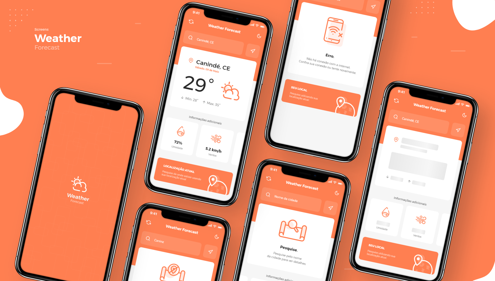
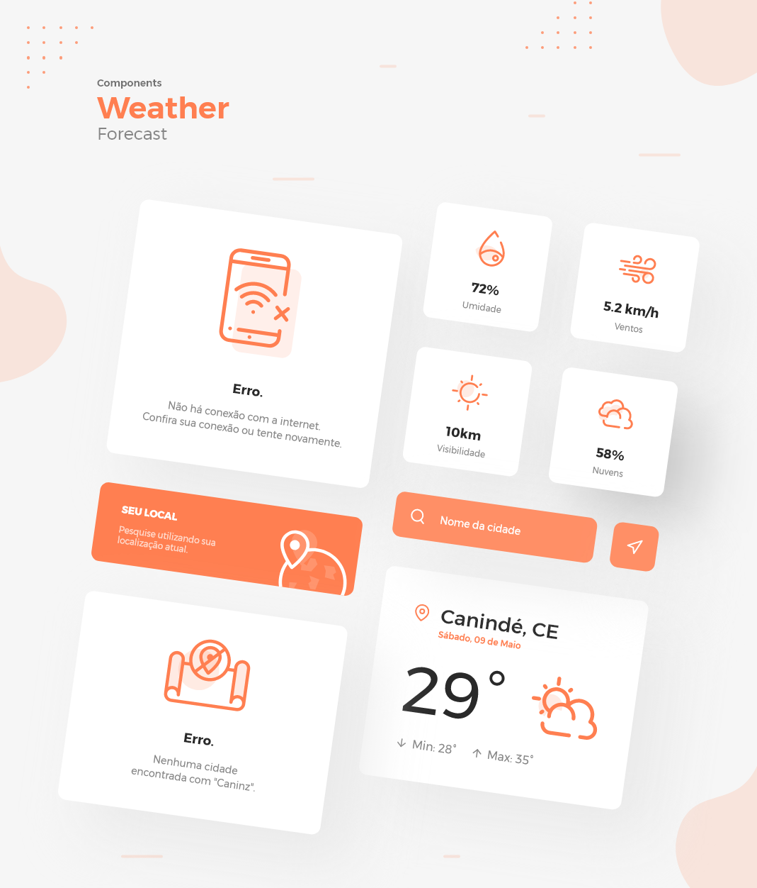

<!-- #  -->

>

<h1 style="color: #888" align="center">
    Weather Forecast
</h1>

  
  
  

>

## 💻 Project

This project was developed to practice and always develop with the best of UI / UX. It's an app, with clear design, weather for iOS and Android.

>

## 🔖 Layout and Design

Prototype developed by <a href="https://www.linkedin.com/in/paulojanai/" style="color: #00a0df" target="_blank">Paulo Janai</a>. See a preview of the app [preview XD](https://xd.adobe.com/view/eadd0e9a-7d6d-4ea3-77c9-df3327e89be6-9cec/).

#### Screens

# 

#### Components

# 

>

## 🚀 Technologies

This project was developed with the following technologies:

- TypeScript
- React
- React Native
  - Animated
- Expo

>

## ☁️ External API

The project used an external API to load the informations.

- [openweathermap](https://openweathermap.org/api)

>

## 👊🏼 Contributing

You are totally allowed to contribute with this project. To do that, fork this repository, make your changes and create a pull request.

> >

<h4 align="center">
    Made by <a href="https://www.linkedin.com/in/antoniorrm/" style="color: #00a0df" target="_blank">Antonio Raimundo</a> and <a href="https://www.linkedin.com/in/paulojanai/" style="color: #00a0df" target="_blank">Paulo Janai</a>
</h4>
